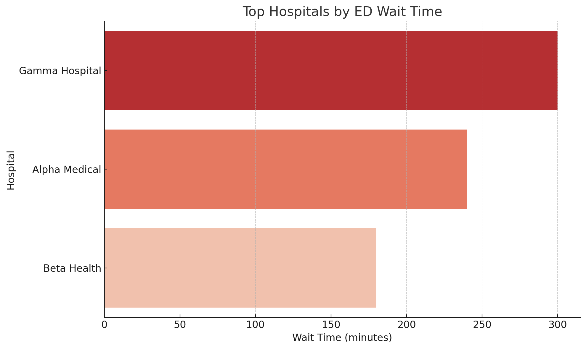

# Patient Wait Time Analysis

This project analyzes hospital emergency department (ED) wait times using publicly available healthcare data. 

## Objective
To identify patterns in patient wait times across different hospitals and measures, and highlight hospitals with high congestion levels.

## Data Source
Centers for Medicare & Medicaid Services (CMS) - Hospital Timely and Effective Care Data

## Steps
1. Load hospital wait time data
2. Clean and filter relevant columns
3. Aggregate and analyze metrics
4. Visualize the top delays and trends

## Tools Used
- Python (Pandas, Matplotlib)
- Jupyter Notebook
- CSV Data

